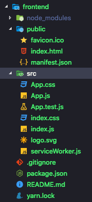
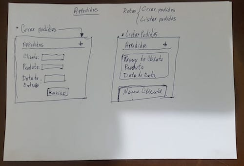
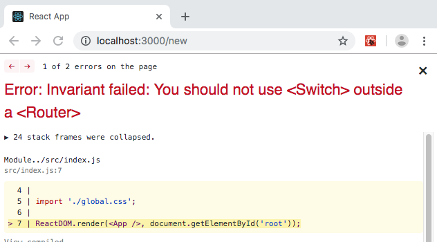
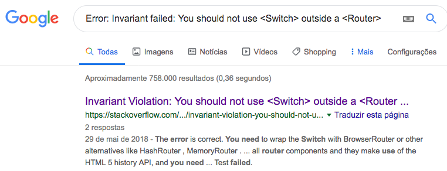
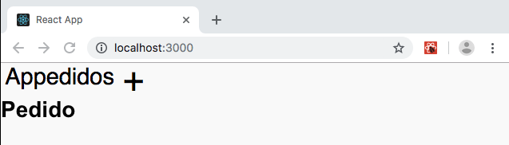
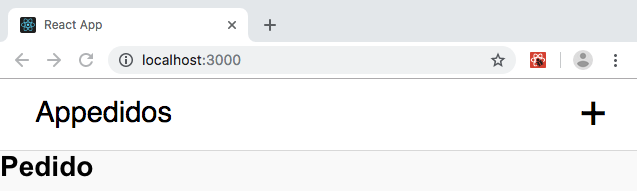
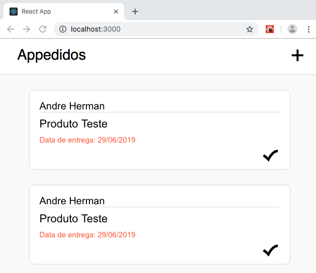
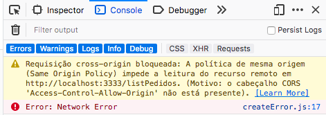
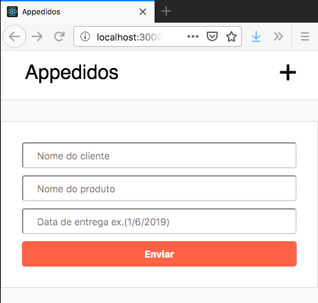

[TOC]

# Pequeno manual introdutório do ReactJS

Dando continuidade à construção da aplicação **appedidos**, vamos construir o nosso *frontend* utilizando ReactJS.

## Iniciando o projeto

Para iniciar o projeto, execute:

```bash
$ yarn create react-app frontend
```

Uma estrutura de diretórios como a da figura abaixo será criada.



Inicie o mongo, dentro da pasta `backend`:

```bash
$ mongod -dbpath mongoDB/
```

Inicie o *backend*, dentro da pasta `backend`:

```bash
$ yarn dev
```

Inicie o *frontend*, dentro da pasta `frontend`:

```bash
$ yarn start
```

Acesse [http://localhost:3000](http://localhost:3000) (se já não houver automaticamente iniciado) acessar o página padrão do frontend com o logo do React.

## Compreendendo a estrutura de arquivos

Um arquivo package.json, bem parecido com o que temos no *backend*, foi automaticamente criado com algumas dependências e scripts padrão. No *backend* nós criamos o script `dev` para esecutarmos com o `yarn`. Aqui, vários scripts estão criados, incluindo o `start`que utilizamos para iniciar o *frontend*.

A pasta `src` também já aparece aqui por padrão, com alguns arquivos de lógica (`.js`) e de estilo (`.css`), além da logo do react.

O arquivo html que o react utiliza está localizado na pasta `public`. Se você abrí-lo com um editor de texto, verá que dentro da seção `body` tem um `div` com `id="root"`. É dentro dsse div que o react coloca todo o design gerado por ele.

## Construção do esqueleto do *frontend*

Vamos começar excluindo alguns arquivos que não nos são necessários. Da pasta `src`, exclua os arquivos `App.css`, `App.test.js`, `index.css`, `logo.svg` e `serviceWorker.js`. Restarão apenas os arquivos `App.js` e `index.js`.

Modifique o arquivo `index.js` para que fique como o abaixo:

```js
import React from 'react';
import ReactDOM from 'react-dom';
import App from './App';

ReactDOM.render(<App />, document.getElementById('root'));
```

Modifique também o `App.js`:

```js
import React from 'react';

function App() {
  return (
    <div className="App">
      <h1>Hello World.</h1>
    </div>
  );
}

export default App;
```

O browser deve ter recarregado a página e você está vendo o famoso Hello World.

### Básico sobre o funcionamento do React

> Vale observar que, como você que lê, eu também estou aprendendo e tudo isso é mais um exercício para mim do que uma tentativa de explicar as coisas com 100% de acurácia. No meio do texto, vou deixando links para leitura complementar que recomendo fortemente que sejam lidos.

O que acontece para que essa frase seja mostrada no navegador é basicamente: O arquivo `src/index.js` é executado e, juntamente com a importação do react e do react-dom, o arquivo `App.js` é importado. A linha seguinte, basicamente, coloca tudo o que for retornado pela função `App()` em `App.js` dentro daquele `div` com `id="root"` do arquivo `public/index.html`. No caso, o que `App()` retorna é um `div` contendo um `h1` que contém o texto `Hello World.`. Em outras palavras, o texto `Hello World` foi renderizado através de um componente.

De maneira simples, podemos entender por componente um arquivo javascript (`.js`) que tem por finalidade retornar um conteúdo JSX. No nosso exemplo o conteúdo [JSX](https://jsx.github.io/) que está sendo retornado pela função `App()` é o código html:

```html
<div className="App">
  <h1>Hello World.</h1>
</div>
```

O componente pode ser um [função](https://developer.mozilla.org/pt-BR/docs/Web/JavaScript/Reference/Operators/function) (como no nosso caso) ou pode ser uma [classe](https://developer.mozilla.org/pt-BR/docs/Web/JavaScript/Reference/Classes), e pode também ser interpretado como um pedaço de código que podemos "isolar" da nossa aplicação. Por exemplo, o cabeçalho de nossa página pode ser um componente, isto é, uma parte de código que não vai interessar nada ao restante de nossa aplicação. Assim, um componente pode conter código estrutural (*html*), código de estilização (*css*) e código de lógica (*javascript*), todos ao mesmo tempo.

## Desenvolvimento do *frontend* específico

> Eu sugiro ao leitor que, ao invés de copiar o colar o código, escreva cada linha, cada palavra e cada letra dos códigos que aqui serão exibidos. Dessa forma você se dá mais tempo para ler o código em si, entender como ele funciona e ainda ajuda a criar uma memória muscular da sintaxe.

Nesse ponto, a aplicação já deve ter o design definido para que ele possa ser implementado. O design pode ser feito em programas como Photoshop, Corel ou inDesign. Eu fiz o meu numa folha de papel mesmo:



As telas compartilham de um mesmo cabeçalho que contém apenas o nome (e futuramente uma logo) da aplicação no lado esquerdo e, no lado direito, um botão de '+'. Esses itens servirão para acessar nossas duas páginas, a de listar pedidos e a de adicionar pedidos, respectivamente.

O corpo da aplicação vai ser modificado de acordo com a página e ser visualizada. A página de adicionar pedidos terá um formulário html com os campos necessários à criação do pedido. A página de listar os pedidos terá '*cards*' com os dados de cada pedido.

Vamos tentar chegar o mais perto possível do design imaginado.

Crie um arquivo `global.css` em `src`. Esse arquivo irá conter a estilização geral da nossa aplicação e faça a importação dele no arquivo `index.js`.

```js
...
import App from './App';

import './global.css';

ReactDOM.render(<App />, document.getElementById('root'));
```

Modifique o arquivo `global.css` para que contenha as seguintes definições de estilo:

```css
* {
    margin: 0;                  /* tamanho das margens */
    padding: 0;                 /* distância entre conteúdo e borda */
    outline: 0;                 /* linha em torno da borda */
    box-sizing: border-box;     /* junta padding e border */
}

body {
    background: #fafafa;                            /* cor de fundo */
    font: 14px Arial, Helvetica, sans-serif;        /* estilo da fonte */
    -webkit-font-smoothing: antialiased !important; /* suaviza a fonte */
}
```

> Não irei explicar a linguagem de estilos `css` porque não é o intuito desse manual. Caso você não saiba o que está acontecendo no código acima, aconselho que pesquise sobre [modelo de caixa do css](https://developer.mozilla.org/pt-BR/docs/Web/CSS/box_model) como um começo.

> Apesar disso, adicionei comentários para explicar minimamente o que cada linha faz.

### Rotas

Assim como no *backend* em nodeJS, nosso *frontend* em reactJS terá diferentes rotas. Como definido no [pequeno manual nodeJS](../backend/README.md), a aplicação tem duas rotas principais: adicionar pedidos (cliente) e listar pedidos (vendedor). Então teremos duas páginas, uma pra cada rota.

Em `src` crie a pasta `pages` e adicione dois arquivos: `Pedidos.js` e `New.js`. Esses são os componentes que retornarão as páginas necessárias às nossas rotas.

Vamos utilizar os componentes em formato de classe para retornar o conteúdo JSX, que no caso é um `<h1>` que identifica a página. Modifique o arquivo `Pedido.js`:

```js
import React, { Component } from 'react';;

class Pedido extends Component {
    render() {
        return (
            <h1>Pedido</h1>
        );
    }
}

export default Pedido;
```

> O método render() é o responsável pelo retorno do conteúdo JSX pela nossa classe. Ele é obrigatório.

Faça o mesmo com o arquivo `New.js` substituindo *Pedidos* por *New*:

```js
import React, { Component } from 'react';;

class New extends Component {
    render() {
        return (
            <h1>New</h1>
        );
    }
}

export default New;
```

Para o gerenciamento de rotas no reactiveJS, adicione o pacote `react-router-dom`:

```bash
$ yarn add react-router-dom
```

Crie o arquivo `routes.js` em `src` e adicione o conteúdo:

```js
import React from 'react';
import { Switch, Route } from 'react-router-dom';

import Pedido from './pages/Pedido';
import New from './pages/New';

function Routes() {
    return (
        <Switch>
            <Route path='/' exact component={Pedido} />
            <Route path='/New' component={New} />
        </Switch>
    );
}

export default Routes;

```

> O código em `routes.js` importa o React primeiro porque estamos utilizando código JSX nas rotas, depois as funções necessárias para fazer o roteamento das páginas do módulo `react-router-dom` e, em seguida, importa as nossas duas páginas: `Pedidos.js` e `New.js`. Em seguida, o código exporta um componente em formato de função, o `Routes()`, para retornar as rotas.

<hr />

#### Usando Switch e Route:

O componente `Route` é o que efetivamente vai rotear a aplicação, ligando os endereços (url) aos componentes (páginas). Assim, as rotas, que são retornadas do componente `Routes()`, também são um componente. Então, a primeira rota `/`, vai chamar o componente `Pedido`. Analogamente, a rota `/New` irá acessar o componente `New`.

O `Switch` vai garantir que **apenas** uma rota será chamada a cada url digitada pelo usuário. O `Route` verifica se o *path* está contido na url, e não se ele é único. Por exemplo: a url `/new/teste` contém o *path* `/` e o *path* `/new`, então o `Route` vai tentar direcionar o usuário para as duas rotas. A utilização do `Switch` fará com que as rotas sejam direcionadas para **apenas** a url que é exatamente (**exact**, no código) igual ao *path*. Usando o mesmo exemplo anterior, a url `/new/teste` seria direcionada **apenas** para a rota de path `/new/teste`.

<hr />

Para que as rotas funcionem, importe as rotas no arquivo `App.js` e chame o componente `Routes` que foi criado. O arquivo `App.js` ficará da seguinte forma:

```js
import React from 'react';

import Routes from './routes';

function App() {
  return (
    <Routes />
  );
}

export default App;
```
 > Como foi dito antes, os componentes retornam JSX, que é basicamente html. Quando chamamos o componente `Routes` ele retorna o JSX que vai depender de qual url estiver sendo chamada, substituindo o html estático que retornava apenas `Hello World`.

#### Lidando com erros

Salve todos os arquivos. Você vai perceber que algo deu errado. Uma página de erro como a mostrada abaixo deverá aparecer.



Quando se está programando, mesmo seguindo um guia como esse, alguns problemas podem acontecer. Eu aconselho sempre pegar a mensagem de erro principal, no nosso caso `Error: Invariant failed: You should not use <Switch> outside a <Router>` e fazer uma pesquisa sobre ele. No Google, o primeiro resultado da busca me direcionou para uma página do [stackoverflow](https://stcakoverflow.com) com a explicação para o problema e solução.



> A maioria dos problemas são comuns e resolvidos rapidamente com uma pesquisa no Google. Outros precisam de um pouco mais de atenção e persistência, e somente uma fração deles não são resolvidos através de pesquisa. Nesses casos, sempre vale a pena perguntar nos fóruns e o stackoverflow é um excelente lugar pra isso.

A explicação sobre o problema foi, basicamente: o componente `BrowserRouter` precisa ser importado e colocado em volta dos componentes que precisam ter acesso às rotas.

A solução é, portanto, modificar o `App.js` da seguinte forma:

```js
import React from 'react';
import { BrowserRouter } from 'react-router-dom';

import Routes from './routes';

function App() {
  return (
    <BrowserRouter>
      <Routes />
    </BrowserRouter>
  );
}

export default App;
```

### Criando o cabeçalho (Header)

Como dito antes, vamos criar um componete *Header*, ou cabeçalho, que aparecerá em qualquer página da aplicação. Começamos criando uma pasta `components`, dentro de `src`, para armazenar os componentes que serão utilizados em mais de um local. Isso garante a [escalabilidade](https://pt.wikipedia.org/wiki/Escalabilidade) da nossa aplicação.

Dentro da pasta `components`, crie o arquivo `Header.js`. Esse componente será escrito em formato de função, com a estrutura básica abaixo:

```js
import React from 'react';

import './Header.css';

export default function Header() {
    return(
        <div />
    );
}
```

Iremos utilizar css para a estilização, então crie um arquivo `Header.css` dentro da pasta `components`. Deixemos o arquivo vazio por enquanto.

```html
<header id="main-header">
    <div className="header-content">
        
        
    </div>
</header>
```
> O cabeçalho é formado por duas imagens: o logo (que, por hora, será apenas o nome da aplicação) e um símbolo de `+`, conforme o nosso design.

A imagem do símbolo `+` foi reirada de [publicdomainvectors](https://publicdomainvectors.org/), digitando *plus* no campo de pesquisa. Faça o download de duas imagens `svg` para representar a logo e o sinal `+` (ou crie você mesmo) e coloque dentro do novo diretório `assets` em `src`, com  os nomes de `logo.svg` e `plus.svg`.

> O reactJS aceita figuras bitmaps (`png`, `jpg`) e vetoriais (como o `svg`).

Modifique o arquivo `Header.js` para importar as imagens e colocá-las no JSX:

```js
import React from 'react';

import './Header.css';
import logo from '../assets/logo.svg';
import plus from '../assets/plus.svg';

export default function Header() {
    return(
        <header id="main-header">
            <div className="header-content">
                
                
            </div>
        </header>
    );
}
```

> Para colocar um código javascript dentro do html, insira o código entre chaves.

Para visualizarmos o cabeçalho, precisamos importar o Header no arquivo `App.js` e adicioná-lo junto com as rotas

```js
...
import Routes from './routes';
import Header from './components/Header';

function App() {
  return (
    <BrowserRouter>
      <Header />
      <Routes />
    </BrowserRouter>
  );
}
...
```

Você deverá visualizar o resultado no navegador após salvar os arquivos.



Vamos adicionar a estilização. Modifique o `Header.css`.

```css
header#main-header {                    /* cabeçalho geral */
    background: #fff;                   /* cor de fundo */
    height: 72px;                       /* altura */
    border-bottom: solid 1px #ddd;      /* borda inferior com 1 pixel de largura */
}

header#main-header .header-content {    /* conteúdo do cabeçalho */
    width: 100%;                        /* largura ocupa 100% da área */
    max-width: 980px;                   /* largura (área) máxima */
    margin: 0 auto;                     /* centralizar */
    height: 72px;                       /* altura igual a do cabeçalho geral */
    padding: 0 30px;                    /* distância entre conteúdo e borda */

     display: flex;                     /* outras opções de alinhamento */
     align-items: center;               /* centraliza verticalmente */
     justify-content: space-between;    /* alinha um item à esq. e outro à dir. */
}

```

Após salvar o `css`, a visualização será esta:



Vamos adicionar links às imagens de forma que a logo nos leve à página de pedidos e o `+` nos leve à página para criar um novo pedido. Para isso, devemos importar o componente `Link` do `react-router-dom` modificando o `Header.js`:

```js
import React from 'react';
import { Link } from 'react-router-dom';
...
```

O componente `Link` serve como a *âncora* (ou *anchor*), mais conhecida como a tag `<a>` do html e seu uso é bem semelhante: coloque a tag JSX `<Link></Link>`em torno do conteúdo que se deseja linkar e adicione a propriedade `to=''` como sendo o `href=''`, ou seja, qual a página que se deseja ir.

Modifique o arquivo `Header.js` para adicionar os links:

```jsx
...
<div className="header-content">
    <Link to='/'>
        
    </Link>
    <Link to='/New'>
        
    </Link>
</div>
...
```

Após salvar, os links devem funcionar.

### Criando a página Pedidos

Acho que a partir desse momento, já sabemos como importar arquivos dentro de outros. Vimos vários exemplos disso até aqui. Portanto não vou mais apresentar o código que deve ser inserido.

Vamos criar um arquivo de estilização (`css`) para a nossa página de listar os pedidos. Crie um arquivo `Pedidos.css` dentro de `pages` e importe esse arquivo dentro de `Pedidos.js`. Novamente, vamos deixar o arquivo `css` vazio por enquanto.

Nessa página, nós iremos pegar os dados retornados pelo nosso *backend* feito em nodeJS e exibi-los. Entretanto, antes de fazer isso, vamos criar uma página estática, com dados arbitrários, que represente a *estrutura* e o *estilo* que queremos dar à nossa página, inserindo código `html` e `css`. Em programação, pode-se chamar isso de *hardcoding*.

Modifique, então, o arquivo pedidos:

```jsx
...
return (
    <section id='lista-pedidos'>
        <article>
            <header>
                <div className='user-info'>
                    <span>Andre Herman</span>
                </div>
            </header>
            <div className='pedido'>
                <span>Produto Teste</span>
                <span className='data-entrega'>Data de entrega: 29/06/2019</span>
            </div>
            <footer>
                
            </footer>
        </article>
        <article>
            <header>
                <div className='user-info'>
                    <span>Andre Herman</span>
                </div>
            </header>
            <div className='pedido'>
                <span>Produto Teste</span>
                <span className='data-entrega'>Data de entrega: 29/06/2019</span>
            </div>
            <footer>
                
            </footer>
        </article>
    </section>
    );
...
```

> Criamos uma seção `<section>` que contém a lista de pedidos. Dentro dela, poderá haver vários `<article>`, sendo cada um deles, um pedido individual.

> O pedido tem um cabeçalho `<header>` com as informações do usuário (por enquanto é só o nome mas, no futuro, pode haver outros dados como telefone, endereço e uma foto). Inserimos um `<span>` com o nome do usuário (para adicionar outro dado basta adicionar outro `<span>`).

> O corpo do pedido, ou seja, as informações do pedido em si, foi colocado dentro de uma `<div>` com um `<span>` para o nome do produto e outro para a data de entrega.

> Por fim, o *card* do pedido tem um rodapé (`<footer>`) que, por enquanto, armazenará apenas uma imagem de um *check* para o vendendor clicar quando o pedido tiver sido entregue.

Foi colocado dois `<article>` exatamente iguais  para representar 2 pedidos. Assim podemos visualizar melhor a estilização quando estivermos preparando o `css`.

Abaixo está o arquivo `Pedidos.css` na íntegra. Sugiro que, a cada linha inserida, se vá verificando o resultado. Dessa forma se consegue perceber o que cada elemento faz.

```css
section#lista-pedidos {
    width: 100%;
    max-width: 580px;
    margin: 0 auto;
    padding: 0 30px;

}

section#lista-pedidos article {
    margin-top: 30px;
    border: 1px solid #ddd;
    border-radius: 10px;
    background: #fff;
    padding: 20px;

}

section#lista-pedidos article header {
    border-bottom: 1px solid #ddd;
}

section#lista-pedidos article header .user-info {
    font-size: 20px;
}

section#lista-pedidos article .pedido {
    margin-top: 10px;
    font-size: 22px;

    display: flex;
    flex-direction: column;
}

section#lista-pedidos article .pedido .data-entrega {
    margin-top: 10px;
    font-size: 15px;
    color: #ff6347;
}

section#lista-pedidos article footer {
    margin-top: 10px;
    margin-bottom: 30px;
}

section#lista-pedidos article footer img {
    float: right;
}
```

O resultado final é mostrado abaixo:



### Carregando informações do *backend*

Precisamos de uma biblioteca (ou pacote) para podermos receber os dados do nosso *backend*. Existem várias bibliotecas que podem fazer isso. Vamos utilizar a `axios`. Execute:

```bash
$ yarn add axios
```

Para manter a organização de nossa aplicação, vamos criar uma pasta, para guardar a comunicação com o api do *backend*, chamada `services` e o arquivo `api.js` dentro dela.

Insira o seguinte código em `api.js`:

```js
import axios from 'axios';

const api = axios.create({
    baseURL: 'http://localhost:3333',
});

export default api;
```

> O código importa o pacote axios e cria uma variável `api` que vai armazenar o conteúdo de retorno do método create (um objeto, com métodos e prorpiedades), definindo um url base, ou seja, o caminho que será comum às requisições da api. Esse é o caminho em que nosso *backend* está ouvindo.

De volta ao arquivo `Pedidos.js`, importamos a variável api que criamos.

```js
...
import api from '../services/api';
...
```

Agora vamos explicar porque escolhemos criar o componente `Pedidos.js` em um formato de classe.

Os dados da api, ou seja, do nosso *backend*, precisa ser carregado antes de ser exibido na página. Um componente em forma de classe possui um método chamado `componentDidMount()` que é executado sempre que o componente for montado em tela. Assim, esse componente é um ótimo lugar para carregarmos as informações de nossa api.

Nossa variável-objeto `api` tem um método `get()` que faz requisições do tipo GET e outro `post()` que faz requisições do tipo POST (duh). Vamos usar esses métodos para carregar os dados do mongoDB de maneira parecida que estávamos fazendo com o Insomnia.

Insira em `Pedidos.js`:

```js
...
import './Pedidos.css';

class Pedido extends Component {

    async componentDidMount() {
        const response = await api.get('listPedidos');
    }

    render() {
...
```

> O objeto `response` conterá uma propriedade `data` com todos os dados do nosso pedido, caso o método `get()` tenha sido bem-sucedido.

No React, quando precisamos armazenar dados em um componente em que suas alterações serão refletidas em outros locais do componente, precisa-se se criar uma variável de estado (`state`). Iremos inicializar ela com um array vazio. Depois vamos utilizar a função `setState()` do React para passar os valores da variável response.data` para `pedidos`.

Modifique `Pedidos.js` para:

```js
import React, { Component } from 'react';
import api from '../services/api';

import './Pedidos.css';

class Pedido extends Component {

    state = {
        pedidos: [],
    }

    async componentDidMount() {
        const response = await api.get('listPedidos');
    }
...
```

> Como `state` é um estado, devemos utilizar `this.setState({feed: response.data})` ao invés de algo como `this.state.pedidos = response.data`. No React, é assim que se faz (como disse, ainda estou aprendendo. Não sei explicar ao certo o porquê).

O que devemos fazer agora é **percorrer** todos os pedidos retornados pela API e gerar um `<article>`. No momento, os articles estão fixos. Para isso, nós iremos utilizar javascript dentro do HTML, então devemos colocar o código javascript dentro de chaves `{}`.

Para percorrer os elementos do array, usaremos a função `map()`. Ela chama a função de [*callback*](https://developer.mozilla.org/pt-BR/docs/Glossario/Callback_function) para cada elemento do array. A *callback* será definida como uma [arrow function](https://developer.mozilla.org/pt-BR/docs/Web/JavaScript/Reference/Functions/Arrow_functions) (função flecha).

Nossa *callback* function é uma função anônima que recebe uma variável `pedido` como argumento e retorna um HTML. O HTML que ele irá retornar é exatamente o que criamos anteriormente.

Com as modificações acima, nosso arquivo `Pedidos.js` fica da seguinte forma:

```jsx
import React, { Component } from 'react';
import api from '../services/api';

import './Pedidos.css';

class Pedido extends Component {

    state = {
        pedidos: [],
    }

    async componentDidMount() {
        const response = await api.get('listPedidos');

        this.setState({ pedidos: response.data });
    }

    render() {
        return (
            <section id='lista-pedidos'>
                { this.state.pedidos.map(pedido => (
                    <article>
                        <header>
                            <div className='user-info'>
                                <span>Andre Herman</span>
                            </div>
                        </header>
                        <div className='pedido'>
                            <span>Produto Teste</span>
                            <span className='data-entrega'>Data de entrega: 29/06/2019</span>
                        </div>
                        <footer>
                            
                        </footer>
                    </article>

                )) }
            </section>
        );
    }
}

export default Pedido;
```

Agora é só substituir os dados que estão fixos pelos dados retornados pela API através da variável `pedido`. Por exemplo, o nome do cliente `Andre Herman` é pra ser substituído por `{pedido.cliente}` (entre chaves porque é javascript dentro de HTML). A variável `cliente` em `pedido` é aquela que foi definida no *backend*.

Após a substituição de todos os elementos dos pedidos, `Pedidos.js` fica:

```jsx
...
return (
            <section id='lista-pedidos'>
                <h1>TEST</h1>
                { this.state.pedidos.map(pedido => (
                    <article key={pedido._id}>
                        <header>
                            <div className='user-info'>
                                <span>{pedido.cliente}</span>
                            </div>
                        </header>
                        <div className='pedido'>
                            <span>{pedido.produto}</span>
                            <span className='data-entrega'>Data de entrega: {pedido.entrega}</span>
                        </div>
                        <footer>
                            
                        </footer>
                    </article>
                    ))
                }
            </section>
        );
...
```

> Note que foi adicionado uma chave com o id do pedido na tag `article` (`key={pedido._id}`). Sempre que a função `map()` for utilizada, é aconselhável adicionar um campo único que identifique cada elemento do array a ser percorrido. Isso faz com que o dado seja encontrado mais rapidamente no banco de dados.

<hr>

#### Verificação de erros

Se, após inserir as modificações, os pedidos não estiverem sendo carregados, abra o console javascript do navegador para ver algum possível erro. Para isso, clique com o botão direito do mouse na página e escolha a opção `Inspecionar`. Clique na aba `Console` veja se um erro com algo similar a isso apareceu:



Se sim, insira o seguinte no arquivo `index.js` da pasta `backend`:

```js
...
const app = express();

// Soluciona erro relacionado com CORS
app.use(function(req, res, next) {
    res.header("Access-Control-Allow-Origin", "*");
    res.header("Access-Control-Allow-Headers", "Origin, X-Requested-With, Content-Type, Accept");
    next();
});
...
```

<hr>

### Criando a página de Novo Pedido

Vamos começar montando nosso formulário em `New.js`. Modifique o arquivo `New.js`:

```jsx
...
const today = new Date();
const data = today.getDate()+'/'+today.getMonth()+'/'+today.getFullYear();

class New extends Component {
    render() {
        return (
            <form id="novo-pedido">
                <input
                  type="text"
                  name="cliente"
                  placeholder="Nome do cliente" />
                <input
                  type="text"
                  name="produto"
                  placeholder="Nome do produto" />
                <input
                  type="text"
                  name="entrega"
                  placeholder={`Data de entrega ex.(${data})`} />
            </form>
        );
    }
}
...
```

Agora vamos adicionar a página de estilos `New.css`:

```css
form#novo-pedido {
  width: 100%;
  max-width: 580px;
  margin: 30px auto 0;
  padding: 30px;
  background: #fff;
  border: 1px solid #ddd;

  display: flex;
  flex-direction: column;
}

form#novo-pedido input {
  margin-bottom: 10px;
  height: 38px;
  border-radius: 4px;
  padding: 0 20px;
  font-size: 14px;
}

form#novo-pedido button {
  padding: 10px 20px;
  border-radius: 4px;
  border: 0;
  background: #ff6347;
  color: #fff;
  font-size: 14px;
  font-weight: bold;
  cursor: pointer;
}
```

Importe `New.css` no arquivo `New.js` e você terá a página conforme a figura abaixo.



#### Armazenando dados do formuário

No React, uma maneira comum de pegar dados do formulário html é armazená-los conforme o usuário vai digitando. Para isso, cria-se uma variável de estado (`state`) com os campos vazios dentro do componente:

```jsx
...
class New extends Component {

  state = {
    cliente: '',
    produto: '',
    entrega: '',
    isEntregue: false,
  };

  render() {
...
```

Através de uma função (a chamaremos de `handleChange()`), os dados irão sendo armazenados. Essa função usa como argumento os eventos (`e`) do html. Essa fução será uma *arrow function* para podermos ter acesso ao *this*.

```jsx
...
state = {
  cliente: '',
  produto: '',
  entrega: '',
};

handleChange = e => {
  this.setState({ [e.target.name]: e.target.value });
}
...
```

> A variável (`target.name`) terá o valor do que está digitado em cada input (`target.value`).

Agora, chamamos a função para cada input, no método *onChange()* e igualar o valor à sua respectiva variável de estado:

```jsx
<form id="novo-pedido">
  <input
    type="text"
    name="cliente"
    placeholder="Nome do cliente"
    onChange={this.handleChange}
    value={this.state.cliente} />
  <input
    type="text"
    name="produto"
    placeholder="Nome do produto"
    onChange={this.handleChange}
    value={this.state.produto} />
  <input
    type="text"
    name="entrega"
    placeholder={`Data de entrega ex.(${data})`}
    onChange={this.handleChange}
    value={this.state.entrega} />
  <button type="submit">Enviar</button>
</form>
```

Criaremos uma função (`handleSubmit()`) que será chamada quando apertamos o botão `Enviar` e a chamaremos no evento `onSubmit` do `form`.

```js
...
handleChange = e => {
    this.setState({ [e.target.name]: [e.target.value] });
}

handleSubmit = e => {
    e.preventDefault();

    console.log(this.state)
}

render() {
  return (
    <form id="novo-pedido" onSubmit={this.handleSubmit}>
      <input
...
```
> O método `e.preventDefault()` serve para prevenir o carregamento automático da página quando o formulário é submetido, vitando assim perder os dados armazenados na variável `state`.

No navegador abra o `console` (clique direito do mouse -> Inspect -> aba Consolse), preencha o formulário e verifique a saída. Você deverá ver a variável `state` e seu conteúdo, que são os dados do formulário.

Temos um objeto pronto pra ser salvo no banco de dados Mongo.

#### Armazenando no BD Mongo

A API será utilizada então devemos importar o arquivo `service/api.js` no arquivo `New.js`.

```js
...
import api from '../services/api';
...
```

No módulo `axios`, o método `post()` pede os argumentos *rota* e *dados*. A rota é `addPedido` e os dados são os do formulário. Vamos criar um objeto `data` para inserir os dados do formulário no formato *Form URL Encoded*:
 
 ```js
handleSubmit = async e => {
    e.preventDefault();

    const data = new URLSearchParams();
    
    data.append('cliente', this.state.cliente);
    data.append('produto', this.state.produto);
    data.append('entrega', this.state.entrega);

    await api.post('addPedido', data);
    
    this.props.history.push('/');
}
 ```

 > Após a inserção pelo método post do axios (`api.post()`), redirecionamos o usuário para a rota (`/`) que é a lista de pedidos (`this.props.history.push('/')`).

## Utilizando WebSockets

Podemos utilizar o WebSockets para que a página seja automaticamente atualizada sempre que ocorra uma mudança (inserção, alteração) dos pedidos, sem a necessidade do usuário clicar no botao *refresh* do navegador.
